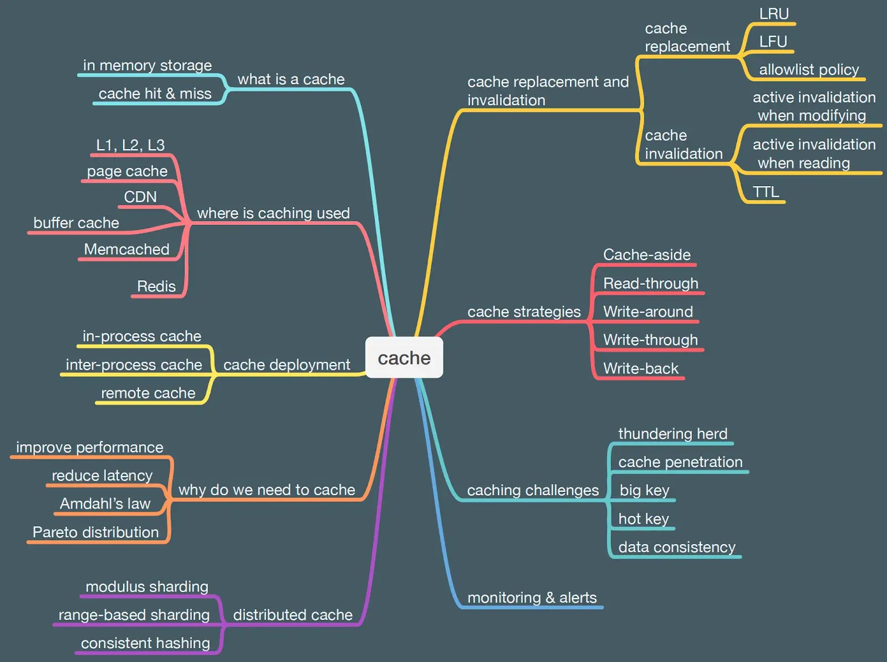

# Cache

## Why we need a cache?

1. **Improve Performance:** By storing frequently accessed data in a cache, systems can retrieve it quickly, reducing the time required for data access and enhancing overall system performance.

2. **Reduce Latency:** Caching data closer to where it's needed minimizes delays, leading to faster response times and a better user experience.

3. **Amdahl's Law:** This principle states that the overall system performance is limited by its slowest component. By caching, we can speed up these slow components, improving the system's efficiency.

4. **Pareto Distribution:** Often, a small portion of data is accessed much more frequently than the rest. By caching this "hot" data, we can optimize resource usage and improve performance.

## Cache hit & miss

| **Operation** | **Description**                  | **Result** |
|---------------|----------------------------------|------------|
| Cache Hit     | Data found in the cache          | Fast retrieval |
| Cache Miss    | Data not found in the cache      | Slow retrieval  |

optimizing caching strategies involves increasing the cache hit ratio

## Cache Replacement & invalidation:

- **Cache Replacement:** Determines which data should be removed from the cache when new data needs to be stored.
  - *Least Recently Used (LRU)*: Removes the least recently accessed data.
  - *Least Frequently Used (LFU)*: Removes data that is accessed less frequently.
  - *Allowlist Policy*: Keeps certain data always in the cache.

- **Cache Invalidation:** Ensures that the cached data is fresh and up-to-date.
  - *Active Invalidation When Modifying*: Removes or updates cached data when the original data changes.
  - *Active Invalidation When Reading*: Validates data freshness when it's accessed.
  - *Time To Live (TTL)*: Removes cached data after a specific period.

## Cache strategies

1. **Cache-aside**: Also known as Lazy Loading, the application is responsible for querying the cache. If the data isn't found, it fetches from the database and caches it for future use.

2. **Read-through**: The cache is placed between the application and the database. When the application requests data, the cache checks if it’s available. If not, it retrieves it from the database, updates the cache, and returns it to the application.

3. **Write-around**: write operations bypass the cache and are written directly to the main storage. The cache is only updated when the data is read again.

4. **Write-through**: Data is written to both the cache and the database simultaneously. This ensures that the cache is always up-to-date but might introduce some latency due to double writes.

5. **Write-back**: Data is written to the cache and marked as dirty. The cache then writes this data back to the database asynchronously. This strategy improves write performance but risks data loss if the cache fails before the write-back completes.

## Cache challenges

1. **Thundering Herd Problem**: This occurs when multiple clients simultaneously request a cache entry that has expired, overwhelming the backend system as it tries to update the cache.

2. **Cache Penetration**: When requests are made for data that doesn't exist in the cache or the backend, it can lead to repeated queries to the backend, bypassing the cache and causing unnecessary load.

3. **Big Key**: Storing large data objects in the cache can lead to inefficient use of cache memory and slow retrieval times.

4. **Hot Key**: A frequently accessed cache key can become a bottleneck if too many requests hit it simultaneously, leading to contention and potential performance degradation.

5. **Data Consistency**: Ensuring that the cache and the underlying data store remain synchronized can be challenging, especially with strategies like Write-back where updates to the cache are delayed.

## Overcoming caching challenges

1. **Thundering Herd Problem**:
   - **Request Collapsing**: Aggregate multiple requests for the same data into a single request.
   - **Staggered Expiry**: Use different expiration times for similar items to prevent simultaneous expirations.

2. **Cache Penetration**:
   - **Bloom Filters**: Use Bloom filters to quickly check if an item exists in the cache before querying the backend.
   - **Cache Invalid Entries**: Cache negative responses (e.g., "not found") for a short period to avoid repeated queries for non-existent data.

3. **Big Key**:
   - **Data Sharding**: Break large objects into smaller pieces and cache them separately.
   - **Compression**: Compress large data objects before caching to save space.

4. **Hot Key**:
   - **Load Balancing**: Distribute requests across multiple cache nodes to spread the load.
   - **Cache Replication**: Create replicas of frequently accessed keys to reduce contention.

5. **Data Consistency**:
   - **Write-through/Write-around Strategies**: Ensure that writes are consistently handled to keep the cache and backend synchronized.
   - **TTL (Time-to-Live) Settings**: Use appropriate TTL settings to ensure stale data is refreshed periodically.

## Cache deployment

### 1. **In-Process Cache**
- **Description:** The cache is stored within the same process that needs it, meaning it resides in the application's memory.
- **Use Case:** Ideal for single-instance applications.
- **Pros:**
  - Fast access to data.
  - Easy implementation.
- **Cons:**
  - Limited by the application's memory.
  - Not suitable for distributed systems.

### 2. **Inter-Process Cache**
- **Description:** The cache is shared among multiple processes within the same machine, typically using shared memory.
- **Use Case:** Useful for applications running on the same server that need to share cache.
- **Pros:**
  - Fast access compared to remote caches.
  - Efficient for inter-process communication.
- **Cons:**
  - Limited by the server's memory.
  - More complex to implement than in-process caches.

### 3. **Remote Cache**
- **Description:** The cache is stored on a separate server, allowing multiple machines to access it.
- **Use Case:** Ideal for distributed systems and cloud-based applications.
- **Pros:**
  - Scalable and can handle large volumes of data.
  - Centralized cache management.
- **Cons:**
  - Slower access compared to in-process and inter-process caches due to network latency.
  - Requires network reliability.

## Distributed cache

### Key Features of Distributed Cache:
1. **Scalability:** By distributing the cache across multiple servers, the system can handle increased load and data volume more efficiently.
2. **Fault Tolerance:** If one cache server goes down, other servers can continue to provide cached data, ensuring high availability.
3. **Load Balancing:** Distributing the load across multiple servers helps in balancing the cache requests, preventing any single server from being overwhelmed.
4. **Data Consistency:** Ensuring that all copies of the cached data are consistent across different servers.

### Common Methods for Implementing Distributed Cache:
1. **Modulus Sharding:** Distributes data based on a key's modulus value. Each server is responsible for a specific range of values.
2. **Range-Based Sharding:** Distributes data based on the range of keys. Each server handles a specific range of keys.
3. **Consistent Hashing:** Uses a hash function to distribute data across servers. This method provides better distribution and fault tolerance.

### Examples of Distributed Cache Systems:
- **Memcached:** An in-memory key-value store that can be deployed as a distributed cache.
- **Redis:** A powerful in-memory data structure store that supports distributed caching.
- **Ehcache:** A widely-used caching library for Java applications that can be deployed in a distributed manner.
